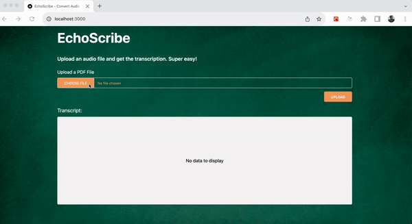

# EchoScribe

  

A project to generate audio transcriptions. Simply upload an audio file and get the transcription in seconds.

## Pre-requisites to run this project

1. OpenAI API Key

## Steps to run this project

1. Clone the repo
2. Run `npm install` to install all the dependencies
3. Create a `.env.local` from `env-example` file: `cp env-example .env.local`
4. Update the OpenAI key in the `.env.local` file
5. Run `npm run dev` to start the project

## Tech Stack

- NextJS
- TailwindCSS
- OpenAI Whisper Model

## Contact

mohdejazsiddiqui@gmail.com